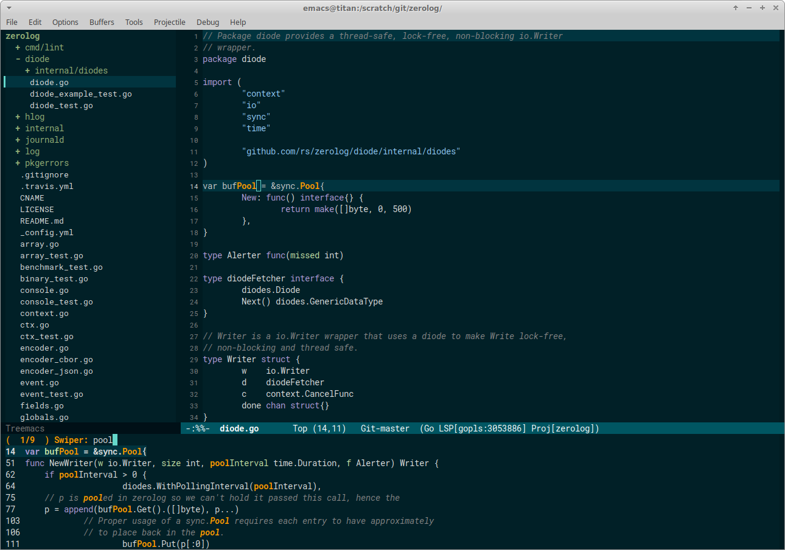
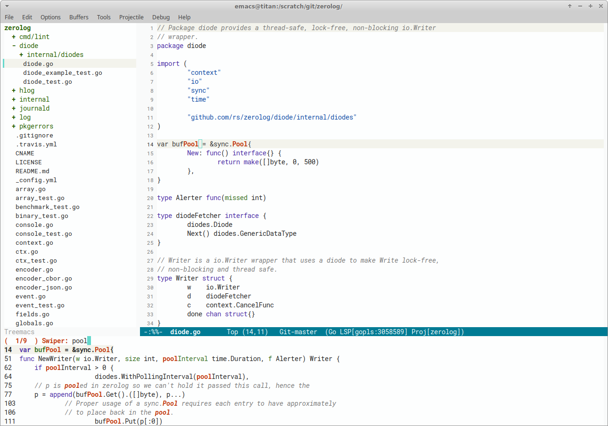

[](https://melpa.org/#/immaterial-theme)
[](https://stable.melpa.org/#/immaterial-theme)


# Emacs immaterial-theme

*Note: for good results in a pure terminal environment, consider installing
Emacs 26 and [enable
truecolors](https://github.com/syl20bnr/spacemacs/wiki/Terminal) in your
terminal.*

Immaterial is an emacs color theme that comes in two flavors: `immateral-dark`
and `immaterial-light`.

In its infancy it was loosely based on the principles of Google's [Material
design](https://material.io/design/color/the-color-system.html#color-theme-creation),
but that's all immaterial ...

Since then it has evolved to become a theme focused on readability and a sober
amount of coloring; enough to help you quickly grasp syntactical structure and
identify key elements without bombarding your senses with an undue amount of
colors (a lot of themes seem to take a "more is more" approach to coloring,
ending up in a christmas tree where no element stands out from the rest).

It is built from a number of "coloring building blocks". Their use is summarized
below. For full details, refer to the [the code](immaterial-theme.el).

- `background`: used for the background of buffers, modeline, etc.

  Comes in three flavors: `background-primary`, `background-on`,
  `background-off`. Most of the background will be colored using
  `background-primary`. `background-on` is used for highlighting or attracting
  attention (such as the active modeline, search candidates,
  etc). `background-off` is used to tone down parts of the screen (such as the
  inactive modeline in a split frame with several buffers).

- `foreground`: used for the majority of the text.

  Comes in three flavors: `foreground-primary`, `foreground-secondary`,
  `foreground-tertiary` with falling degree of use in the theme.

- `primary`, `secondary`, `tertiary`: these groups of colors are accent colors
  that are used mostly to highlight syntactical elements (in code) or other
  notable text elements (such as headings, links, etc). Each comes in three
  forms to give some variation to the accent: "plain", "low contrast", "high
  contrast" (contrast being relative to the background):

  - `primary`, `primary-hi`, `primary-lo`:
    - code use: keywords, constants
    - text use: headings
  - `secondary`, `secondary-hi`, `secondary-lo`:
    - code use: types, variables
    - text use: code/verbatim elements, timestamps
  - `tertiary`, `tertiary-hi`, `tertiary-lo`
    - code: strings
    - text use: links

- some additional colors for specific types of highlighting:

    - `discrete`: for less pronounced text (code comments, line numbers).
    - `error`: for highlighting erroneous code.
    - `warning`: for highlighting suspicious code. Also used to highlight search
      matches.
    - `cursor`: the color of the cursor.
    - `vertical-border`: the color of the vertical line that separates windows
      in a frame.
    - `modeline-active-fg`: foreground color for active buffer modeline.
    - `modeline-active-bg`: background color for active buffer modeline.
    - `modeline-inactive-fg`: foreground color for inactive buffer modelines.
    - `modeline-inactive-bg`: background color for inactive buffer modelines.
    - `diff-{added,changed,removed}`: diff highlighting
    - `diff-{added,changed,removed}-refined`: higher-granularity diff
      highlighting

All colors are defined in the default `immaterial-color-alist` (tip: enable `rainbow-mode` when exploring).

Each color can be overridden through the `immaterial-color-override-alist`
variable, which overrides the defaults in the `immaterial-color-alist`. As an
example, to provide a different primary color palette:

``` emacs-lisp
(setq immaterial-color-override-alist
  '(("background-primary" . ((dark  . "#000000") (light . "#eeffdd")))
    ("background-on"      . ((dark  . "#003300") (light . "#ddffaa")))
    ;; override 'primary' only for dark theme
    ("primary"            . ((dark  . "#80cbc4")))
    ;; override 'warning' only for light theme
    ("warning"            . ((light . "#ed4079")))))
```

**Note**: the [Material color tool](https://material.io/resources/color) is
useful when experimenting with color palettes and variants of a certain
color. For dark themes, less saturated colors (200 and less) from the color
palette improves readability.

**Note**: emacs [rainbow-mode](https://elpa.gnu.org/packages/rainbow-mode.html)
comes in handy for highlighting each hex color being edited in you emacs init
file.


## Screenshots

### immaterial-dark




### immaterial-light




## Install

- From MELPA (or MELPA stable) via:

        M-x package-install RET immaterial-theme

        ;; load dark theme
        (load-theme 'immaterial-dark t)

        ;; ... or load light theme
        (load-theme 'immaterial-light t)

- Via `use-package`:

        (use-package immaterial-theme
          :ensure t
          :config
          (load-theme 'immaterial-dark t))

- By adding `immaterial-theme.el` to `~/.emacs.d/themes` and the following to
  your `init.el`:

        (add-to-list 'custom-theme-load-path "~/.emacs.d/themes")
        (load-theme 'immaterial-dark t)
